# Скриншоты LexOS

Все снимки сделаны в QEMU (1024×768, стандартная VGA). Главное описание
системы — в [README проекта](../../README.md).

## Первый запуск

При первом запуске LexOS сразу показывает графику: зелёный экран и
карточку, которая по шагам спрашивает всё нужное.

| | |
|---|---|
|  |  |
| **1 / 5 — имя.** Как LexOS будет к тебе обращаться (до 12 букв). | **2 / 5 — пароль.** Спрашивается при каждом старте; можно оставить пустым. |
|  |  |
| **3 / 5 — часовой пояс.** Влево/вправо по миру, под поясом — города. | **4 / 5 — раскладки клавиатуры.** Английская есть всегда, русскую и испанскую включаешь галочкой (Пробел). |
|  |  |
| **5 / 5 — язык системы.** English, Русский или Español: на нём будут справка, меню и сообщения. | **Готово** — и сразу рабочий стол. |

## Вход и выход

| | |
|---|---|
|  |  |
| **Вход** при каждом следующем старте, если задан пароль. Неверный — карточка «трясётся». | **«Выйти из системы»** в меню Пуск возвращает к экрану входа; без пароля — кнопка «Войти» и Enter. |
|  | |
| **Выключение / Перезагрузка** из меню Пуск: прощание от кота Lex, и QEMU закрывается. | |

## Рабочий стол

| | |
|---|---|
|  |  |
| **Рабочий стол** — значки из папки `/DESKTOP`, панель задач, часы. | **Меню Пуск** ищет программы, пока печатаешь. |
|  |  |
| **Программы в окнах** — Fire, Cube и Maze работают одновременно. | **MAZE.APP** — лабиринт в стиле Wolfenstein, развёрнутый на весь экран. |
|  |  |
| **Прилипание окон** — тащишь к краю, рамка показывает, куда встанет окно. | **Правый клик по рабочему столу** — терминал, файлы, задачи, фон, спрятать кота. |
|  |  |
| **Недавние программы** стоят первыми в «Программах». | **Фоны** (Ночь, Закат, Океан, Сланец) поверх любой темы. |

## Кот Lex 🐱

LexOS названа в честь кота Lex — и он живёт в системе.

| | |
|---|---|
|  |  |
| **Команда `lex`** — кот говорит что-нибудь (или твой текст). Внизу сам Lex гуляет по панели задач и спит (Zzz); клик — «Мяу!». | **`neofetch`** — сведения о системе рядом с ASCII-котом Lex. |
|  |  |
| **Lex — тамагочи.** Правый клик по нему: покормить, погладить (сердечко и мурчание), поиграть (он гоняется за курсором), «Как дела у Lex?». | **Покормили** — миска рядом, а над котом сытость, радость и бодрость. Голодный или одинокий Lex грустит: не гуляет, сидит с закрытыми глазами и слезинкой. Состояние хранится в `DESKTOP.CFG` вместе со временем — пока компьютер выключен, время тоже идёт. |

## Окна и программы

| | |
|---|---|
|  |  |
| **Задачи** — графики процессора и памяти, приоритеты, «Завершить». | **Файлы** — поиск по имени и сортировка. |
|  |  |
| **Копирование файлов** — Ctrl+C / Ctrl+X / Ctrl+V; занятое имя получает `_2`. | **Развёрнутый терминал** показывает сверху строки, ушедшие с экрана. |
|  |  |
| **CUBE.APP** — вращающийся куб, вычисления с плавающей точкой в кольце 3. | **MANDEL.APP** — множество Мандельброта 800×600 в true color. |

## Терминал: конвейеры и файловая система

| | |
|---|---|
|  | |
| **Конвейеры и перенаправление:** `ls \| grep A`, `help \| grep file \| head 4`, `date > LOG.TXT`, `>>`. **`ls -l`** — тип, «только чтение», дата изменения, размер. **`attrib +r`** — файл нельзя удалить или изменить. **`fsck`** проверяет файловую систему; запись идёт через **журнал**, так что внезапное выключение не оставит её наполовину изменённой. | |

## LexOS Web — браузер

| | |
|---|---|
|  |  |
| **LexOS Web** (значок WEB или `run browser.app`) — страницы с диска (`/DEMOS/SITE`) или из сети по `http://`. Заголовки, абзацы, ссылки, списки, `<pre>`, цвета; назад/вперёд/обновить/домой, адресная строка, прокрутка колесом. | **Картинки BMP**, текст по центру, цитаты; ссылка под курсором краснеет, её адрес — в строке состояния. |
|  |  |
| **Страницы в UTF-8** по-русски и по-испански — шрифтом системы. | **HTTPS**: pypi.org, открытый прямо в LexOS. TLS 1.3 (а теперь и 1.2) написан для LexOS с нуля (X25519 и P-256, AES-128-GCM, ChaCha20-Poly1305); зелёная метка TLS в адресной строке. Соединение зашифровано, но сертификат сервера не проверяется — в LexOS нет списка удостоверяющих центров. |
|  | 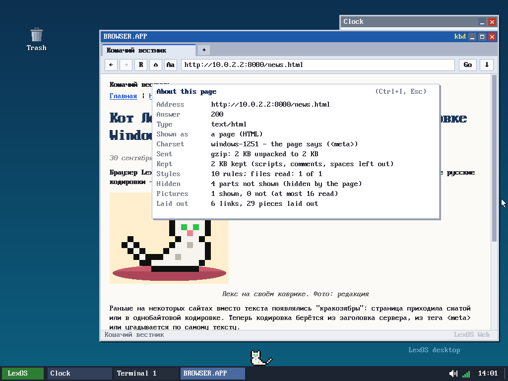 |
| **Без «кракозябр»**: эта страница пришла сжатой gzip и в кодировке windows-1251. Браузер сам распаковывает gzip/deflate, а кодировку берёт из заголовка сервера, из `<meta>` или угадывает по тексту (windows-1251, KOI8-R, CP866, ISO-8859-5, Latin-1). Простой CSS: скрытые меню, баннеры и подписи для экранных дикторов не показываются, цвета, жирный, курсив, центрирование, фон страницы. Картинки JPEG (и прогрессивные) и GIF. | **Ctrl+I — «Об этой странице»**: ответ сервера, тип, кодировка и откуда она взята, сколько пришло сжатым и сколько после распаковки, сколько правил CSS и скрытых блоков, сколько картинок. **Ctrl+U** открывает исходный код страницы в новой вкладке. JSON и текст показываются как текст, картинка — как картинка, остальное предлагается скачать. |
|  |  |
| **Режим чтения** (кнопка **Aa** или F9): только сама статья (`<article>`, `<main>`) — без меню, боковых колонок, кнопок «поделиться», комментариев и подвала; узкая колонка, тёплый фон, больше места между строками. | **Без ограничения на размер страницы**: 40 000 абзацев, почти 6 МБ текста — страница показана целиком, до последней строки. Когда браузеру не хватает своих 4 МБ, ядро выдаёт ему ещё память (кусками по 4 МБ, до 64 МБ). Скачивание файлов тоже без ограничения: файл пишется прямо на диск, сколько бы он ни весил. |
|  |  |
| **Диск LexOS — FAT32.** `df` показывает, сколько места занято; `ls -l` — время и размеры; `fsck` проверяет цепочки кластеров. Образ диска можно открыть где угодно: в Linux (`mount -o loop,offset=1048576`, `mdir -i os-image.bin@@1M`) видны все файлы LexOS с длинными именами — и наоборот, файлы, положенные из Linux (с кириллицей, пробелами, строчными буквами), появляются в LexOS. Журнал защищает от выключения посреди записи. | **Таблицы — настоящей сеткой.** Сначала браузер измеряет столбцы (самое длинное слово и самую длинную строку в каждом), потом раздаёт им ширину: если всё помещается — по тексту, иначе каждому его самое длинное слово, а остаток делится. Каждая ячейка верстается в своём столбце, строка таблицы высотой с самую высокую ячейку; `border`, `bgcolor`, `colspan`, `align`, `width="100%"`, заголовки `<th>`. Вложенные таблицы внутри ячейки — по-старому, ячейки друг за другом. |
| 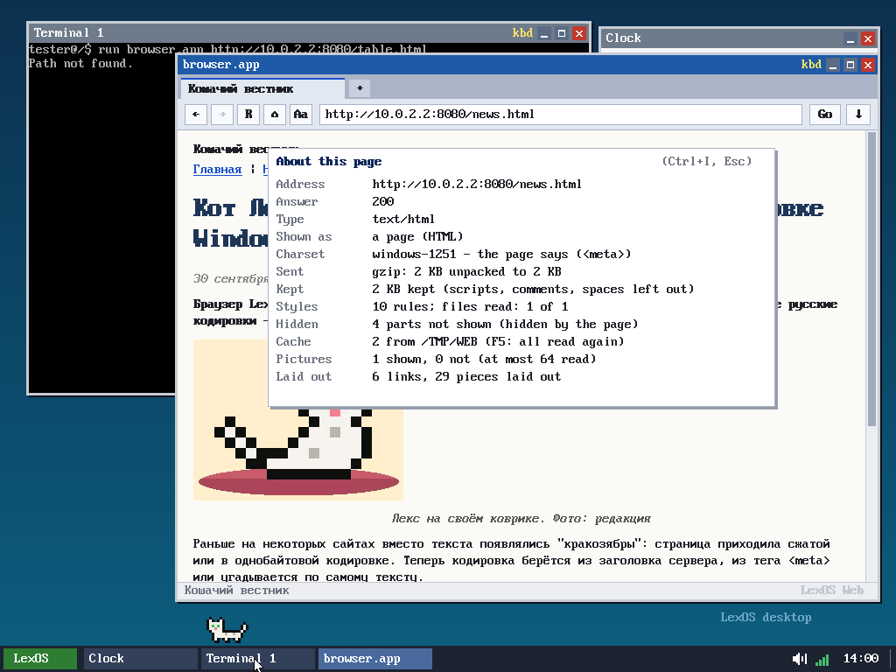 |  |
| **Кэш в /TMP/WEB.** Картинки и файлы стилей с сайтов сохраняются на диск (папка TMP теперь обычная папка на диске и переживает перезагрузку) — при повторном заходе они берутся оттуда, без сети. 64 файла (`W00`…`W3F`) по хэшу адреса, каждый до 512 КБ, так что кэш не разрастается. Ctrl+I показывает, сколько взято из кэша; F5 перечитывает всё из сети. | **Тысячи файлов.** Слотов теперь 8192 вместо 1024, и папки могут лежать в любом из них (родитель — 16 бит), так что ограничения «255 папок» больше нет. Здесь диск, на который из Linux положили 300 папок и 3000 файлов: окно «Файлы» показывает папку с 3301 элементом, отсортированным (до 4096 в папке). |
|  |  |
| **Длинные имена в программах.** Диалоги «Открыть»/«Сохранить» в Блокноте, Paint и других показывают длинные имена (и русские), открывают файлы по ним и сохраняют под ними. | **Длинные имена в терминале**: `cat "My long file name.txt"`, `cd "Мои документы"`, `mkdir "Новая папка"`, `echo привет > "Файл с пробелами.txt"`. Tab дописывает длинное имя (в кавычках, если в нём пробелы). Новые имена получают короткое имя вида `NOVAYA~1`, а длинное — рядом. |
|  |  |
| **Формы**: поля ввода, пароли, многострочные поля, галочки, переключатели, выпадающие списки, кнопки. Отправка GET или POST — в кодировке самой страницы (сайту в windows-1251 уходит windows-1251). Enter в поле отправляет форму, Tab — к следующему полю. **Куки** сохраняются в `/TMP/WEB/COOKIES`, так что входы и настройки на сайтах держатся. Слова, набранные в адресной строке вместо адреса, **ищутся** (через HTML-версию DuckDuckGo). | **Страницы, которые рисует JavaScript**, больше не пустые. JavaScript браузер не выполняет, но такие сайты почти всегда несут свой текст внутри — в JSON (`__NEXT_DATA__`, `application/ld+json`), в `window.__STATE__ = {...}`, в потоке Next.js. Браузер находит там строки, похожие на предложения (а не на код, классы или адреса), и показывает их внизу вместе с описанием страницы из `<meta>`. |
|  |  |
| **Ctrl+F — поиск на странице**: внизу появляется строка поиска, все совпадения подсвечены, текущее — оранжевым, «2 of 3». Enter или F3 — следующее, с Shift — предыдущее, Esc — закрыть. Регистр не важен, и для русских букв тоже. | **Выделение и копирование**: протяните мышью по тексту (Ctrl+A — весь текст), **Ctrl+C** копирует в общий буфер обмена — теперь его видят и Терминал, и Блокнот, и Win+V. Здесь скопированное вставлено обратно в адресную строку через Ctrl+V. Для этого у программ появился системный вызов 47 (`clip_text`). |
|  |  |
| **Подсказки в адресной строке**: пока набираете, снизу появляются закладки (звёздочка) и страницы, где вы уже были, — сначала те, чей адрес так начинается, потом те, где набранное встречается в адресе или заголовке. Стрелки и Enter или клик. | **Понятные ошибки**: «Такой страницы нет», «Сайт нас не пустил», «У сайта проблемы», «Нет ответа», «Не удалось зашифрованное соединение» — с объяснением и тем, что попробовать: ещё раз, копию в Internet Archive, тот же адрес по http://, поиск по сайту. |
|  |  |
| **Закладки**: Ctrl+D или звёздочка у адресной строки (горит, если страница в закладках). Ctrl+B — страница закладок, Ctrl+H — история; у каждой строки [x]. Хранятся в `/TMP/WEB/BOOKMARK` и `/TMP/WEB/HISTORY`. | **TLS 1.2 и кривая P-256**: теперь открываются и сайты, которые не умеют TLS 1.3 или X25519. Здесь тестовый сервер OpenSSL только с TLS 1.2, ECDHE на P-256 и ChaCha20-Poly1305. |

Ещё в этой версии браузера: `<iframe>` превращается в ссылку «[Embedded: www.youtube.com — open]»; `<meta http-equiv=refresh>` выполняется (так сайты отправляют браузеры без JavaScript на простую версию); reddit открывается как old.reddit.com, поиск Google и DuckDuckGo — через HTML-версию DuckDuckGo; если сервер прислал страницу в brotli или zstd (их LexOS распаковать не может), браузер переспрашивает её без сжатия. CSS прячет больше: свёрнутые блоки (`height:0; overflow:hidden`), невидимые (`opacity:0`) и текст, сдвинутый за край ради логотипа (`text-indent:-9999px`). Символы: значки из шрифтов-иконок (Font Awesome и т. п.) больше не превращаются в «?», греческие буквы — в латинские, смайлики — в `:)` и `:(`, полноширинные и «математические» буквы — в обычные, флаги и комбинируемые ударения не мешают. Длинные слова и адреса переносятся после `/`, `-`, `.`, `?`, а не где попало.

Чего браузер всё ещё не умеет: выполнять JavaScript (у страниц, собранных скриптом, видно только текст, без кнопок и меню; сайты с проверкой «вы человек?», вроде Cloudflare, и сайты Google не откроются), `display:flex` и grid (блоки идут друг под другом), веб-шрифты, показывать `<iframe>` на месте. TLS: нет обмена ключами RSA, шифров CBC и TLS 1.0/1.1; сертификаты не проверяются. Копируется не больше 2 КБ за раз (размер буфера обмена), поиск не находит слова, разорванные переносом строки.

## Файлы без консоли

| | |
|---|---|
|  |  |
| **Правый клик по рабочему столу или пустому месту в Files → «Создать»**: при наведении открывается подменю — папка, TXT, HG (скрипт), ярлык. | **Имя спрашивается в диалоге** — оно уже выделено, так что набор его заменяет. Так же работают «Переименовать» и «Копировать в» в Files, а у значков на рабочем столе своё меню: открыть, переименовать, удалить (в корзину). |
|  |  |
| **«Свойства»** — у файла в Files и у значка на рабочем столе: где лежит, что это, размер (у папки — сколько в ней всего), когда менялся, и галочка **«Только чтение»**. | **Перетаскивание**: из Files на рабочий стол — файл переезжает в `/DESKTOP`, значок встаёт туда, где отпустил (на значок-папку — в неё). Значок с рабочего стола в окно Files — в его папку. С зажатым **Ctrl** — копия. |
|  | |
| **Корзина помнит, откуда файл**: в TRASH есть «Восстановить» — файл возвращается в свою папку (а если её нет или имя занято — в корень). | Значки на рабочем столе стоят по **невидимой сетке**: новый занимает первую свободную клетку, а отпущенный после перетаскивания — ближайшую свободную; друг на друга и под окна они не налезают. |

## Блокнот

| | |
|---|---|
|  |  |
| **NOTEPAD.APP** — вкладки, выделение мышью, Ctrl+C / X / V, отмена Ctrl+Z / Ctrl+Y, поиск Ctrl+F и замена Ctrl+H, переход к строке Ctrl+G. **Подсветка C**: ключевые слова, типы, строки, числа, комментарии. Files открывает текстовые файлы в нём, а в меню есть «Изменить в Блокноте». | **HTML и скрипты HG тоже подсвечиваются.** Файлы в UTF-8 (русский, испанский) показываются правильно и сохраняются обратно в UTF-8. |

## Markdown и ZIP

| | |
|---|---|
|  |  |
| **Markdown в LexOS Web**: файл `.MD` (с диска или из сети) показывается как страница — заголовки, списки, код, цитаты, таблицы, ссылки. Пример — `/DEMOS/README.MD`. | **«Сжать в ZIP»** в меню Files: deflate со своими кодами Хаффмана для каждого блока и CRC-32 — такой архив открывает любой unzip. Готово — строка вверху экрана. |
|  |  |
| **«Распаковать сюда»** — в папку с именем архива. Распаковываются и архивы с других компьютеров. | **Двойной клик по `.ZIP` — просмотр архива**: папки (двойной клик — внутрь, Backspace — назад), размер и степень сжатия каждого файла, текст или картинка BMP видны прямо до распаковки; «Распаковать всё» или «Распаковать выбранное». |
|  |  |
| **Корзина в левом верхнем углу**: когда в ней что-то есть, из неё торчат бумажки. Двойной клик — открыть, перетащить на неё значок или файл из Files — удалить, правый клик — «Очистить корзину». У браузера — глобус, у Блокнота — блокнот с карандашом, у ZIP — молния. Длинные имена на рабочем столе переносятся на вторую строку. | **«Свойства» → «Изменить иконку...»**: сетка всех иконок — папка, файл, TXT, приложение, картинка, звук, HG, C, BAS, TRG (черепашка), CH8 (чип), CFG, глобус, блокнот, ZIP, геймпад, терминал, кот Lex, шестерёнка, звезда, нота, корзина. Первая — своя иконка файла. |
|  |  |
| **Иконки выбраны**: у игр геймпад, у CUBE — Lex. Выбор хранится в самой записи файла, поэтому переезжает вместе с ним. | **Корзина**: внизу кнопки «Восстановить все» и «Очистить корзину», «Удалить навсегда» работает без консоли, а `/TRASH` создаётся сама, так что `..` есть всегда. Клавиша **Del** удаляет выделенное: иконки на рабочем столе, если последний клик был по нему, иначе выделенные файлы в окне Files. У ярлыков (`.LNK`) в углу иконки — маленькая стрелочка. |

## Новые программы и возможности

| | |
|---|---|
|  |  |
| **Paint** (`PAINT.APP`): карандаш, кисть, ластик, линия, прямоугольник, закрашенный прямоугольник, овал, круг, заливка и пипетка. Левая кнопка рисует первым цветом, правая — вторым. Четыре толщины, Ctrl+Z / Ctrl+Y, размер холста меняется за уголок. Сохраняет в `.BMP`; в Files у картинок есть «Изменить в Paint». | **Калькулятор** (`CALC.APP`): обычный и инженерный (Tab переключает). Набирается выражение со скобками и приоритетом операций, ответ считается сразу. Есть sin/cos/tan и обратные (градусы или радианы), ln, log, степени, корень, факториал, π, e и память. |
|  |  |
| **Files**: слева панель — Рабочий стол, Программы, Недавние, Корзина, Этот диск. Кнопка вида переключает значки и **таблицу** (имя, размер, дата изменения, тип); клик по заголовку столбца сортирует. | **Миниатюры**: `.BMP` в Files показываются уменьшенной копией самой картинки. |
|  |  |
| **Обои из любой BMP**: в Files правый клик по картинке → «Сделать обоями». Картинка обрезается по форме экрана; две готовые лежат в `/DEMOS/WALLS`. | **Несколько иконок сразу**: рамка мышью или Ctrl+клик. Выбранные перетаскиваются и удаляются вместе, а **Ctrl+Z** возвращает всё обратно (перемещение, удаление в корзину, переименование). |
|  |  |
| **Win+L — блокировка**: большие часы, дата и пароль. Программы под ней продолжают работать. | **Панель управления** (бывшая «Система»): Оформление (тема, фон, обои, Lex, заставка), Звук, Клавиатура (язык сразу, раскладки), Дата и время (часовой пояс), Мышь (скорость указателя, двойной клик), Пользователи. |
|  |  |
| **Несколько пользователей**: у каждого свой рабочий стол и свои настройки. На экране входа стрелки влево/вправо переключают пользователя. Нового добавляют в Панели управления → Пользователи. | **Проверка диска при загрузке**, если в прошлый раз LexOS выключили не штатно (например, просто закрыли QEMU): `fsck fix` с полосой прогресса. |
|  |  |
| **Заставка**: после 1, 3 или 10 минут без дела летят звёзды и плавает время. Любая клавиша или мышь — обратно. | **Вкладки в LexOS Web**: до 8 страниц сразу; «+», крестик, Ctrl+T / Ctrl+W / Ctrl+Tab; Ctrl+клик открывает ссылку в новой вкладке. |
|  |  |
| **Lex замечает, что происходит с файлами**: очистили корзину — мурлычет, удалили навсегда — пугается, вернули — радуется. Ночью он в основном спит. У действий с файлами свои звуки. | **Язык меняется сразу**, прямо из Панели управления. |

## Новое: просмотрщик, уведомления, экран, длинные имена

| | |
|---|---|
|  |  |
| **Просмотр картинок** (BMP и PNG): «Вписать», 1:1 и масштаб от 10% до 800%, колесо приближает к курсору, увеличенную картинку можно таскать мышью. Стрелки листают, Home/End — первая и последняя, Пробел запускает слайд-шоу (3 секунды). Внизу панель с кнопками и надписью «2 / 3  200%». | **Центр уведомлений** — клик по часам. Все сообщения, которые всплывали сверху: последние шесть, со временем. «Очистить» и «Не беспокоить» (сообщения сохраняются, но не всплывают и не звучат). Красная точка у часов — есть новые. Под списком — календарь. |
|  |  |
| **Длинные имена файлов** — до 63 символов, с пробелами и строчными буквами. Устроено как VFAT: у файла остаётся короткое имя (`TRIPTO~1.TXT`, им пользуется терминал), а длинное хранится рядом. Его показывают Files (на значке в две строки), рабочий стол, «Свойства» и `ls`. | **Разрешение экрана** в Панели управления → Оформление: 800×600, 1024×768, 1280×720, 1280×1024. Меняется сразу: окна и значки остаются на экране, обои и фон пересчитываются. Для 1280 нужно 256 МБ памяти (`make run` так и запускает QEMU). Там же — **анимации окон**: окно вырастает при открытии, сворачивается в кнопку на панели задач. |

## Новые программы

| | |
|---|---|
|  |  |
| **SHEET.APP** — электронная таблица: формулы (`=E6/3`, `SUM`, `AVG`, `MIN`, `MAX`), копирование со сдвигом ссылок, файлы `.CSV` (пример — `DEMOS/BUDGET.CSV`). | **MUSIC.APP** — плеер для WAV, MOD и IMF: плейлист, пауза, перемотка, громкость, повтор и случайный порядок. |
|  | |
| **Игры стали программами в окнах** (папка `APPS`): Тетрис с тенью фигуры и «Hold», Змейка, Сапёр (три уровня, окно меняет размер), 2048. Лучшие результаты сохраняются. | |
|  |  |
| **Alt+Tab** — панель посреди экрана со значками и названиями окон (последнее использованное — первым). Tab (и Shift+Tab назад), пока держите Alt; отпустили — выбранное окно впереди, свёрнутое разворачивается. | **Shift+PrintScreen** — снимок части экрана: обведите мышью нужное (размер виден под рамкой), Esc или правая кнопка — отмена. Снимок сохраняется в `SHOTnn.BMP` и попадает в буфер: Ctrl+V в Paint его вставит. |
|  |  |
| **Часы** (здесь — по-русски): вкладки «Будильник», «Таймер» и «Секундомер» с кругами. Будильник и таймер звонят, даже когда окно закрыто: гудок раз в секунду, строка сверху, окно Часов открывается само (и заставка уходит); клик в Часах — выключить. | **SOLITAIRE.APP** — «Косынка» мышью: карты перетаскиваются между стопками, двойной клик отправляет карту в «дом», правая кнопка — всё, что можно. Отмена (U / Ctrl+Z), сдача по 1 или по 3 (D), таймер и лучшее время. |
|  | |
| **Paint**: инструмент «Текст» (T; Enter — новая строка, четыре размера) и «Выделение» (S): рамку можно двигать мышью (с Ctrl — копию), стрелками, Delete стирает, Ctrl+C / Ctrl+X / Ctrl+V — через буфер картинок (туда же попадают скриншоты и картинки, скопированные в Files). Файл, брошенный на окно программы, открывается в ней: картинка — в Paint, текст — в Блокноте, музыка — в плеере. | |
| 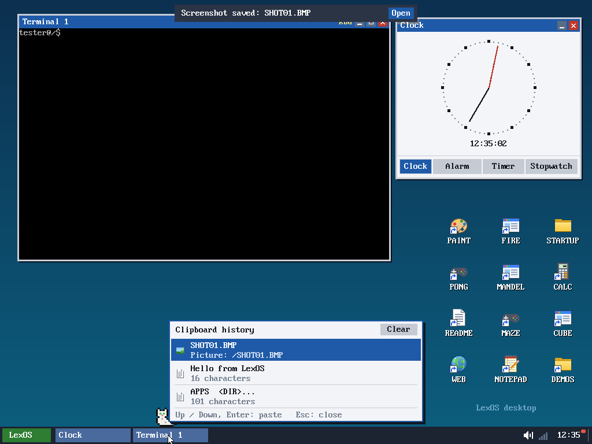 | 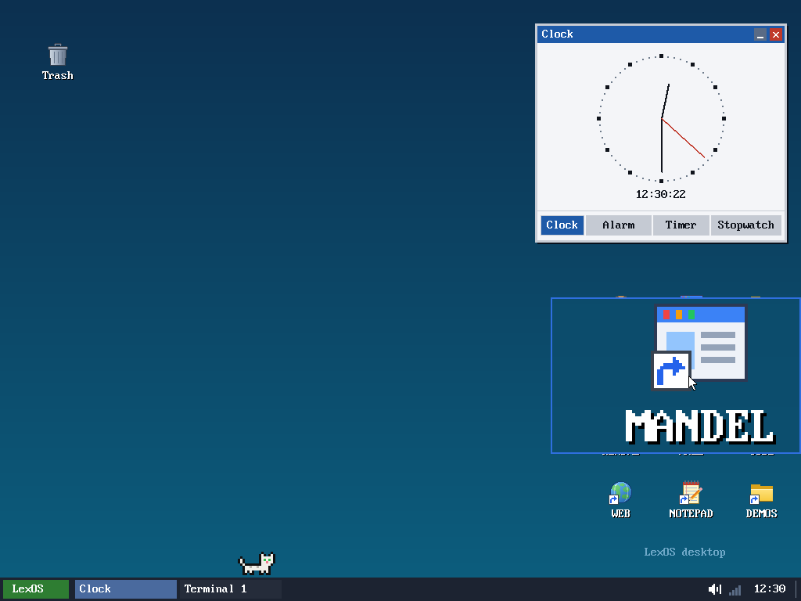 |
| **Win+V — история буфера обмена**: последние 8 текстов и картинок, новые сверху. Клик (или стрелки и Enter) — снова в буфер: текст сразу вставляется, картинка ждёт Ctrl+V в Paint. «Очистить» — забыть всё. | **Win+Plus — лупа** вокруг указателя: ×2, ещё раз — ×4; Win+Minus — меньше, Win+Esc — убрать. |
| 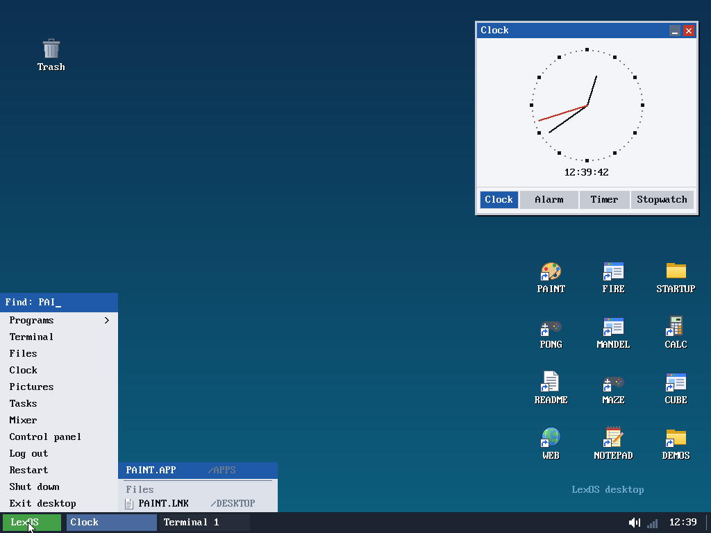 | 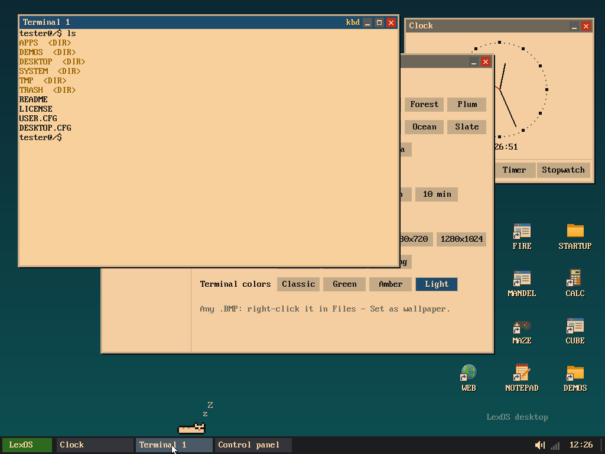 |
| **Поиск в меню «Пуск» находит и файлы**: под программами — «Файлы» со всего диска (по длинному и короткому имени) и папка каждого; Enter или клик открывает как двойной клик. | **Ночной свет** (Панель управления → Оформление: Выкл / Вкл / Вечером, 19:00–7:00) — экран теплее. Там же **цвета терминала**: обычные, зелёные, янтарь, светлые. Lex здоровается при входе по времени суток, охотится за указателем над панелью задач и в наушниках кивает под музыку. |

## Lex: окна, мячик, праздники, дневник

| | |
|---|---|
| 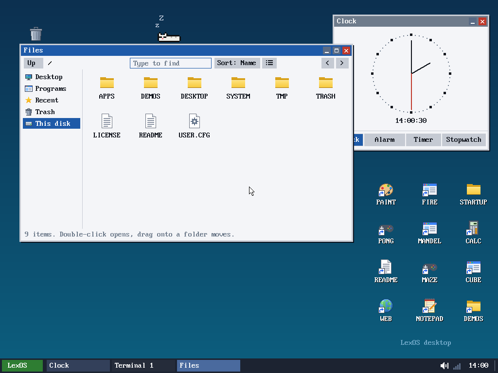 | 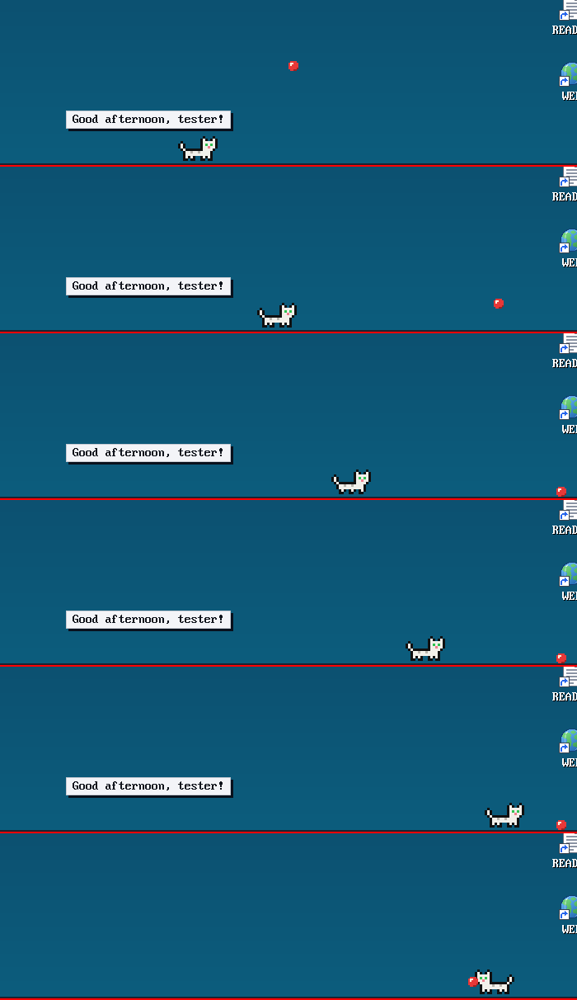 |
| **Lex залезает на окна**: время от времени запрыгивает на заголовок окна впереди и гуляет (или спит) по нему. Окно сдвинули, закрыли или вывели вперёд другое — спрыгивает. | **Бросить мяч** (меню Lex): мяч отскакивает по панели задач, Lex бежит за ним, берёт в зубы и приносит обратно — «Ещё! Ещё!». |
| 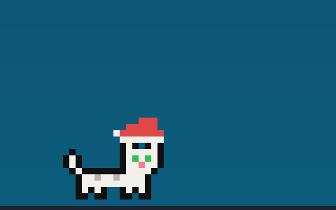 | 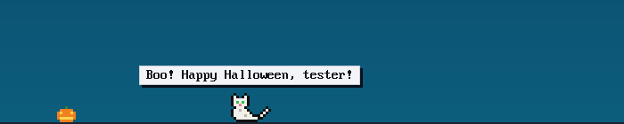 |
| **Декабрь** (и до 7 января) — колпак Деда Мороза; 31 декабря и 1 января — «С Новым годом». | **С 24 октября** — тыква у панели задач; 31 октября — «Бу! Счастливого Хэллоуина». |
|  | 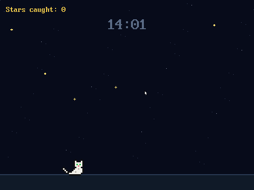 |
| **День рождения Lex** — день, когда он у вас поселился (хранится в `DESKTOP.CFG`): праздничный колпак и поздравление. | **Заставка «Ночь Lex»** (Панель управления → Оформление → Вид заставки): звёзды падают, Lex бегает по земле и подпрыгивает за ними, счёт пойманных. |
| 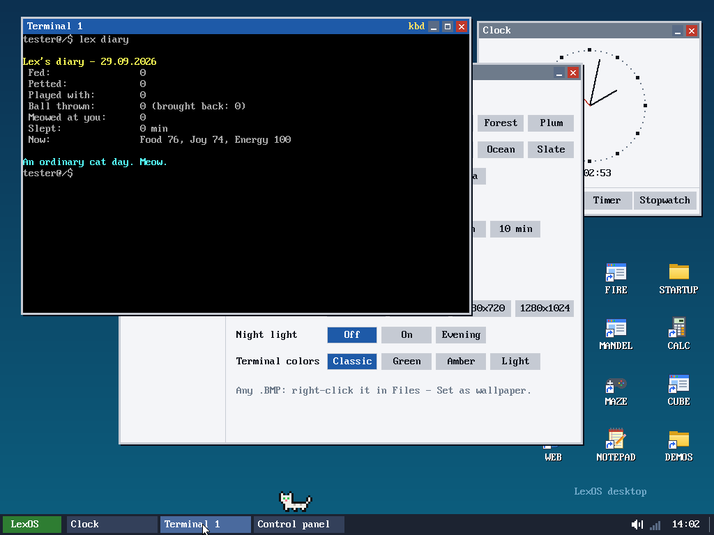 | 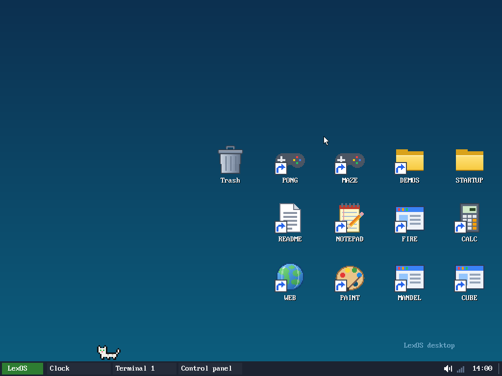 |
| **`lex diary`** — дневник дня: сколько раз покормили, погладили, играли, бросали мяч, сколько спал, как он сейчас, и итог дня. | **Размер значков** (Панель управления → Оформление → Значки): мелкие, обычные, крупные (64×64); значки перестраиваются по новой сетке, Корзина остаётся в углу. |
| 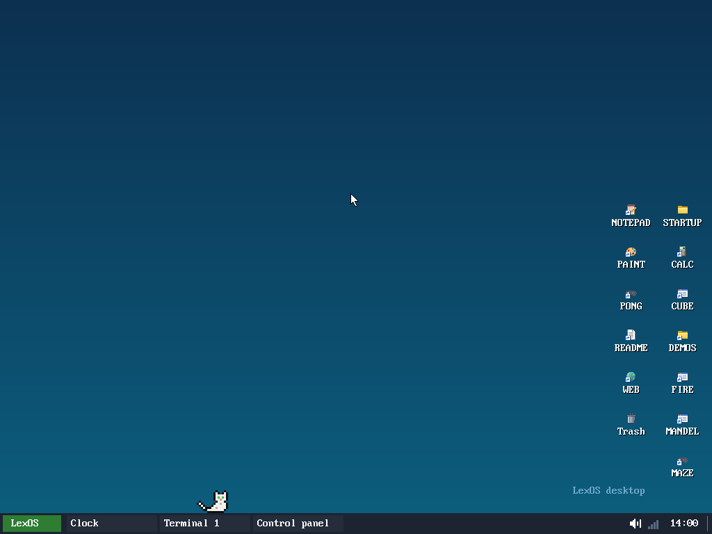 | |
| Мелкие значки (16×16). | |

## Программы для Linux

LexOS теперь запускает обычные программы для Linux — статические 32-битные ELF-файлы для x86, как есть, без пересборки: `run ИМЯ`, просто имя для лежащих в `/LINUX` и `/DOWNLOADS` (`lua`, `busybox sh`) или двойной клик в «Файлах». Ядро узнаёт ELF по заголовку и запускает `/SYSTEM/LINUX.APP`, а тот загружает программу в своё окно памяти (`0x08000000`–`0x09FFFFFF`, со своим каталогом страниц) и отвечает на её системные вызовы Linux (`int 0x80`) вызовами LexOS — около 200 штук: файлы и папки, память, время, терминал, процессы, сигналы. Для этого у ядра появился системный вызов 48 (`lx_op`).

| | |
|---|---|
|  |  |
| **BusyBox** — сотни команд Linux в одном файле. `busybox sh` — настоящий Linux-шелл (ash) прямо на файлах LexOS: `ls -l --color`, конвейеры `cat \| grep \| wc`, `du \| sort \| tail`, `uname -a` («Linux lexos 5.10.0-lexos … i686»). История стрелками, Tab, Ctrl+C. Внутри шелла каждая команда есть как `/bin/ИМЯ`. | **vi из BusyBox** в Терминале LexOS: полноэкранные программы работают, потому что `LINUX.APP` — это эмулятор терминала VT100 (цвета, перемещение курсора, очистка, области прокрутки, второй экран), с режимами termios (построчный и «сырой») и клавишами в виде escape-последовательностей. |
|  |  |
| **Lua 5.4** — интерпретатор, собранный статически под Linux (musl), лежит на диске: `/LINUX/LUA` и пример `/LINUX/DEMO.LUA` (цвета, числа Фибоначчи, сортировка, чтение файла, эллипс, `os.date`). | **`tools/linux/lxtest.c`** — 36 проверок системных вызовов (файлы, папки, `mmap`, `fork` + `pipe`, `waitpid`, `posix_spawn`, сигналы, `nanosleep`, `poll`, `/dev/null`…): все проходят. |

**Как получить BusyBox.** Сам BusyBox на диск не положен (у него лицензия GPL), но он скачивается одним кликом: откройте в LexOS Web `https://busybox.net/downloads/binaries/1.35.0-i686-linux-musl/busybox` — он сохранится как `/DOWNLOADS/BUSYBOX`. Дальше в Терминале: `busybox sh`, `busybox ls -l /DEMOS`, `busybox --list`. Подробности — в `/LINUX/README.TXT`. Свои программы можно собрать `tools/linux/build.sh` (zig cc или любой i386 musl gcc, `-static`).

Что работает: файлы и папки LexOS, терминал (цвета, курсор, vi), клавиатура (Ctrl+C останавливает программу), конвейеры, скрипты, `fork`/`exec`/`wait`, до 16 процессов по очереди, сигналы с обработчиками, время с часовым поясом LexOS, UTF-8 ↔ CP866 для русских букв. Проверены: `sh`, `vi`, `ls`, `grep`, `sed`, `awk`, `find`, `xargs`, `sort`, `tar czf`/`tzf`, `gzip`, `md5sum`, `du`, `df`, `date`, `hexdump` и др.

Чего нет: сети (сокетов), потоков, графики, программ с динамическими библиотеками, 64-битных программ и программ, слинкованных ниже адреса `0x08000000` (lld от LLVM по умолчанию кладёт их на `0x10000` — нужен `-Wl,--image-base=0x8048000` или static-pie). Код, данные и память программы вместе — до 32 МБ. Процессы переключаются только на системных вызовах: фоновое задание продвигается, пока шелл чего-то ждёт, а цикл без системных вызовов Ctrl+C не остановит (закройте Терминал). `ps` пуст (нет `/proc`), `busybox ls` показывает `?` вместо русских букв в именах, а русский текст виден, когда в LexOS включён русский язык.

## Компилятор C внутри LexOS

| | |
|---|---|
|  |  |
| **`run cc.app hello.c`** — программа на C компилируется прямо в LexOS в машинный код x86 и получается `HELLO.APP`; её тут же можно запустить. Примеры — в `/DEMOS/C`. | **RINGS.C** — анимированная графика 320×200, тоже собранная внутри LexOS. |

## Языки

| | |
|---|---|
|  |  |
| **Русский язык системы** — справка `help`, меню, окна и сообщения на русском. | **Español** — меню, `neofetch` и всё остальное на испанском. |
|  | |
| **Русские буквы и раскладка ЙЦУКЕН** в терминале; выделение и Ctrl+C / Ctrl+V. | |

## Темы

| | | |
|---|---|---|
|  |  |  |
| Classic | Dark | Light |
|  |  | |
| Forest | Plum | |
